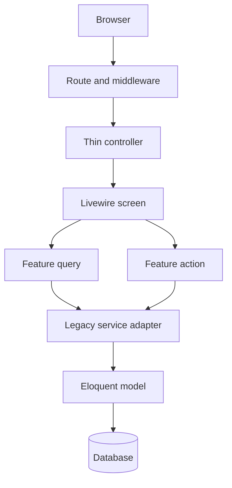

# FlowTrack architecture

> **Current-state note (Phase 13):** The executable source has completed Phases 0–13. Phase 13 makes `resources/js/app.js` a composition root, centralizes Livewire navigation and Reverb lifecycle/event contracts, route-loads narrow features, and limits legacy browser globals to one compatibility bridge. Use `docs/refactor/CURRENT_STATE.md` and the phase implementation records as the source of truth; later roadmap phases remain target state until implemented.


FlowTrack is a Laravel 13 and Livewire 4 modular monolith. It keeps one deployment unit and one transactional database while enforcing feature boundaries in source code. This is the appropriate operating model for the current team and an expected concurrent audience of roughly 50–60 people: it avoids distributed-system overhead while preserving a clean path to split workloads later.

## Request flow



The `Legacy service adapter` is intentionally temporary. New presentation code must enter a feature through a Query or Action. Existing service behavior is retained behind those interfaces until each workflow has regression coverage and can be moved safely.

## Backend layout

```text
app/
├── Actions/
│   ├── Orders/            # Phase 5 touched Order write use cases
│   ├── Inquiries/         # Phase 6 Inquiry write-use-case boundaries
│   ├── Clients/           # Phase 7 Client profile/lifecycle writes
│   ├── MasterData/        # Phase 7 Master Data writes/deletions
│   └── Setup/             # Phase 7 Workflow/Task Pack setup writes
├── Queries/
│   ├── Orders/            # permission-scoped Order list/detail reads
│   ├── Inquiries/         # permission-scoped Inquiry list/detail/workflow reads
│   ├── Dashboard/         # focused authorized Dashboard section read models
│   └── Reports/           # report transport/read-model boundaries
├── Http/
│   ├── Controllers/       # transport only
│   └── Middleware/        # shared request policy
├── Livewire/
│   ├── Orders/Index.php   # focused operational Orders list
│   ├── Jobs/
│   │   ├── Index.php      # Order route/deep-link/state compatibility coordinator
│   │   └── Concerns/      # focused Order UI workflow concerns
│   ├── Inquiries/
│   │   ├── Index.php      # Inquiry route/deep-link/state compatibility coordinator
│   │   └── Concerns/      # focused Inquiry UI workflow concerns
│   ├── MasterData/
│   │   ├── Index.php      # Phase 7 Master Data state coordinator
│   │   └── Concerns/      # family/list/editor/catalog/taxonomy concerns
│   └── Clients/
│       ├── Index.php      # Phase 7 Client state coordinator
│       └── Concerns/      # list/profile/address/lifecycle/page-data concerns
├── DTOs/                  # immutable non-trivial transport/application payloads
├── Models/                # persistence, relationships and explicit fillable policy
├── Policies/              # AccessControlService-backed record authorization adapters
├── Services/
│   ├── Orders/            # focused Order capabilities
│   ├── Inquiries/         # focused Inquiry capabilities
│   ├── Dashboard/         # focused Dashboard capabilities
│   ├── SecureDocumentStorage.php # quarantine/private/legacy document boundary
│   ├── UploadSecurityService.php # file validation and malware scanning
│   └── Legacy*Service.php # temporary compatibility implementations
└── Support/               # pure helpers, presenters and hardened file responses
```

### Backend rules

1. Controllers validate transport concerns and delegate.
2. Livewire components coordinate UI state; business writes belong in Actions.
3. Queries must apply authorization scope before reading records.
4. Actions accept a user/actor explicitly and re-check authorization in the service or policy layer.
5. Transactions, audit activity and notifications stay together at the write boundary.
6. Feature classes may depend on shared infrastructure; shared infrastructure must not depend on Livewire.
7. No request-handling closure belongs in a route file.


### Dashboard/reporting read-model rules

- `DashboardPrimaryQuery` composes section Queries; it must not call the legacy `primaryData()` aggregate entry point.
- KPI summary, flow distribution, task-status distribution and catalogue readiness use short-lived array caches owned by `DashboardReadModelCache`.
- Priority, attention, mentions, team performance, client portfolio and activity stay uncached because they are bounded operational/read-report results where freshness is more important than serialization cost.
- Existing SQL aggregate semantics remain authoritative: counts/sums/grouping execute in SQL rather than hydrating full collections for dashboard metrics.
- `DashboardService` remains a compatibility facade solely so older callers and write-side cache invalidation keep working while the focused Queries are validated.
- Inquiry Intelligence Livewire enters through `Queries/Reports/InquiryIntelligenceReportQuery`; the existing service remains its calculation implementation until a measured need justifies further report-service decomposition.
- Materialized summary tables are intentionally absent until production volume and p95/query evidence justify them.

## Frontend layout

```text
resources/
├── css/
│   ├── application/       # import-only cascade composition entries
│   ├── foundation/        # tokens, reset/accessibility and global type
│   ├── components/        # reusable UI elements
│   ├── modules/           # domain-owned styles grouped by screen family
│   ├── app.css            # authenticated composition root
│   └── utilities.css      # narrowly scoped utilities
└── js/
    ├── core/              # session, navigation, realtime, timezone
    ├── components/        # reusable DOM behavior
    ├── features/          # feature-specific behavior
    └── app.js             # composition root only
```

`resources/js/app.js` is the authenticated JavaScript composition root. Lifecycle/infrastructure modules live under `resources/js/core`, reusable browser behavior under `resources/js/components`, and narrow route-driven code under `resources/js/features`. Phase 15 removes deprecated broad `window.FlowTrack*` aliases; `resources/js/core/browser-api.js` owns only the minimal `window.FlowTrack.ui`, `.realtime` and `.events` namespace required by Alpine/Blade. The authenticated layout loads `resources/css/app.css` directly through Vite; the former generated `flowtrack-01..04` source-chunk mechanism is deleted. `PageAssetResolver` still adds one route-specific entry from `resources/css/pages`. Vite owns compilation, hashing and the production manifest. `public/build` is generated output and must correspond to the same source revision; stale build artifacts are never shipped.

### Frontend rules

1. Blade contains semantic markup and Livewire/Alpine bindings, never `<style>` blocks, `style` attributes, raw DOM event attributes or manual source asset tags.
2. Static styling belongs in the smallest relevant CSS module.
3. Validated runtime values are passed with typed `data-*` attributes and enhanced by `dynamic-styles.js`.
4. Reusable browser behavior is initialized idempotently and must survive `livewire:navigated`.
5. Images use lazy loading and asynchronous decoding where appropriate.
6. `resources/css/flowtrack.css`, `resources/css/legacy/`, and `resources/css/migration/` must remain absent.
7. No CSS source file may exceed 100 KB.
8. Composition entries contain imports/comments only; selectors belong in `components` or a domain folder under `modules`.
9. Run `npm run quality:css-modularization` after CSS ownership changes.

## Security boundaries

- Authentication and module permissions remain route middleware concerns.
- Record visibility is applied to database queries before hydration.
- CSRF protection remains enabled; recovery only refreshes a stale session token.
- Security headers include clickjacking, MIME sniffing, referrer and permissions protection.
- CSP ships in report-only mode until production telemetry proves all Livewire and third-party behavior is compatible; then it should be enforced.
- HSTS is emitted only for HTTPS production requests.
- User locale is allow-listed (`en`, `zh`) before application.
- Release packages exclude `.env`, SQLite data, logs, dependencies and runtime uploads. A verified Vite build may be included as deployable output.
- Eloquent models use explicit `$fillable` lists. Primary keys are excluded by default; only the existing Workflow/Task Pack mirror/snapshot models explicitly allow `id` where synchronized identifiers are a required compatibility invariant. Timestamps and soft-delete fields are not broadly mass assignable.


### Business document security

- New Order, Inquiry, Product-document, Finance attachment and authenticated rich-text business files are written to `flowtrack_quarantine`, inspected, and promoted to `flowtrack_private` only after acceptance.
- Physical names are randomized; original display names remain application metadata.
- `StoredFileResponse` is the authorized streaming boundary and forces EPS/ESP/AI/PostScript-like content to attachment download.
- Existing public/local document paths remain dual-readable only during migration. `flowtrack:migrate-private-documents` copies and verifies them; `--delete-source` removes the legacy source only after verification.
- User ZIP archives are inspected as containers and are never automatically extracted.
- Quarantine retention is independent of business-record retention and is purged by the scheduled quarantine command.
- Public UI assets (branding, profile/client/product images) remain intentionally public and are not part of the sensitive-document disk.

## Performance and scale

- Use pagination and bounded remote selectors; never hydrate full catalogs for a list screen. Phase 11 records every current `->get()` occurrence in `quality/phase11-query-inventory.json`; new/moved occurrences must be reclassified.
- Select only rendered columns and eager-load only rendered relationships.
- Move email, spreadsheet and expensive notification fan-out to queues.
- Use Redis for shared cache/session/queues in multi-instance production.
- Run Reverb and queue workers as supervised processes, separate from PHP web workers.
- Cache framework configuration, events, routes and views during deploy.
- Phase 11 composite indexes target the current Order/Task/Inquiry/Document/Notification/Activity/Master Data/Client filter and sort shapes; verify them against a representative MySQL dataset with `php artisan flowtrack:performance:explain`.
- Local/testing environments detect and log Eloquent lazy-loading violations without changing production request semantics.
- Measure p95 response time, slow queries, query totals, queue delay, error rate and WebSocket reconnects against the configured performance budgets.
- Load-test the three busiest workflows with at least 60 authenticated virtual users before production acceptance.

## International UX

Browser timezone synchronization and the user locale are applied centrally. Dates should be stored in UTC and formatted through `WorkspaceSettingsService`. English and Simplified Chinese are the currently allow-listed locale codes. Most existing interface copy is still embedded in views; future feature work must move user-facing strings into `lang/en` and `lang/zh` before claiming full translation coverage.

## Definition of done

A change is complete when formatting, application tests, architecture tests and the production Vite build pass in CI; authorization is tested for allowed and denied users; list queries are bounded; and no source CSS/JS or environment data is written to `public` or committed.


## Phase 14 horizontal infrastructure boundary

FlowTrack can run multiple stateless PHP web nodes behind a load balancer when the explicit horizontal profile is enabled. User sessions, application cache and queues are Redis-backed; Reverb servers coordinate through Redis; uploaded/public media and private documents use shared mounted storage or the optional S3-compatible private disk; queue workers, scheduler and Reverb are supervised independently of PHP-FPM.

`/up` is liveness only. `/health/ready` is the load-balancer readiness boundary and checks DB/cache/queue/shared storage. Application business routes remain unchanged. The default single-node profile is retained as the configuration-level rollback path. See `docs/infrastructure-scalability.md`, `docs/backup-restore.md` and `docs/refactor/PHASE_14_IMPLEMENTATION.md`.


## Phase 15 release governance

`.github/workflows/flowtrack-ci.yml` is the release policy owner. It enforces Phase 0→15 architecture gates, clean dependency installation, Pint/PHPUnit, Vite/bundle budgets, dependency audits, optional authenticated visual/browser regression and tag build reproducibility. `quality/phase15-legacy-exceptions.json` remains the backend Legacy-service exception register. CSS compatibility sources have been removed; CSS ownership is governed by `quality/css-finalization-manifest.json` and the modularization gate. `OperationsMetrics` provides bounded Redis-backed operational telemetry and scheduled alert evaluation; see `docs/observability.md`, `docs/ci-cd.md`, and `docs/legacy-exceptions.md`.

## Post-Phase-15 modular theme package

Static application theming is now owned by `resources/theme/flowtrack/`. The approved Dashboard management palette is the default system theme. `settings.css` is the single editable source for brand colors, application surfaces, typography, radii/shadows and sidebar design. `aliases.css` bridges this source to the existing `--ft-*`, Dashboard, sidebar and historical variable aliases while preserved module rules are incrementally normalized.

The Dashboard management stylesheet and sidebar stylesheet are owned by the theme package. Runtime Master Data colors remain data-owned and are intentionally outside static theme control. The remaining CSS source is fully module/component owned; there is no active `legacy/compatibility` directory.
